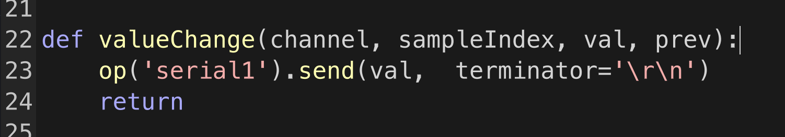

# TD_Arduino_FR

**On how to communicate via Serial between Touchdesigner and Arduino.**

- The [introduction to Touchdesigner](https://github.com/LucieMrc/IntroTD)

# Set-up

Have an arduino connected to the computer, sending informations to the Serial monitor :

```
void setup() {
  Serial.begin(9600);
}

void loop() {
  Serial.write("1");
  delay(1000);
  Serial.write("0");
  delay(1000);
}
```

Here, my code sends in turn 0 et 1 every seconds.

I use `Serial.write()` rather than `Serial.println()` so I send the values as bytes.


I get all the values in the Serial monitor of the Arduino IDE.

We NEED to close the Serial monitor so the Serial messages arrives in Touchdesigner, as the arduino will only communicates with one at the same time.
In the same way, we must deactivate the Serial communication in Touchdesigner if we want to upload code on the arduino, otherwise the port will be busy.

In Touchdesigner, we create a `Serial` DAT that will receive and store messages in an array.


In order to get the datas, we first have to select the port in the Serial DAT parameters. We click on the ➡️ arrow on the right of the "Port" parameter to see the list of avaible ports.


As we send the datas as bytes, we need to select "One Per Byte" in the "Row/Callback Format" parameter (instead of the default "One Per Line").


If everything is good, we get the datas in the Serial DAT every seconds.

# Getting the data from Arduino to Touchdesigner


We create a `DAT To` CHOP, to get the last data received and turn it into a data that we can use.
We have to drag and drop the `Serial` DAT on top of the `DAT To` CHOP so the CHOP "looks" at the DAT.


To look only at the last line (= the last data received), we choose "By Index" in the "Select Rows" parameter. Then, we take the index of the last line for "Start Row Index" and "End Row Index".

By default, there is 10 lines in the Serial DAT, so I put 10 for both row indexes.

We can select all columns as there is only one column, but we have to select that the data from the line is the value we want and not the name of the value.


To do so, we select "Values" (instead of "Names" by default) in the "First Column is" parameter. We then have a value whose name is "chan1" (default value name in Touchdesigner) and which alternate between 0 et 1.

# Use the data

<details>
 <summary> Check if the value is on a data range </summary>

We create a `Logic` CHOP, we check "Off when outside bounds" and we choose the Bounds parameter.


The Logic is 1 if the value is between in bounds and 0 if outside. 
We can choose a precise value by putting the same number in both bounds.

</details>

 <details>
 <summary> Change the data range </summary>

 We create a `Math` CHOP and we go to the "Range" tab of the parameter window.
 We put the minimum and maximum of the current data range in the "From Range" parameter, and the minimum and maxium of the desired data range in the "To Range" parameter.


The value is remapped proportionally.

</details>


<details>
 <summary> Interpolate the values </summary>

 We create a `Filter` CHOP, we chose the length of the filter in the "Filter Width parameter".


The data curve is smoothed.

</details>

# Sending data to Arduino from Touchdesigner

Having an arduino connecting to the computer that receives Serial messages :
 
```
int incomingByte = 0;

void setup() {
  Serial.begin(9600);
}

void loop() {
  if (Serial.available() > 0) {
    incomingByte = Serial.read(); // storing the messages received into the variable incomingByte

    Serial.println(incomingByte); // printing the message received
  }
}
```

We keep the Serial monitor closed in the Arduino IDE so the port can be free to communicate with TouchDesigner.


In Touchdesigner, we create a `Serial` DAT, and like for the data reception, we choose the port on which the Arduino is connected.

To send for example the value of a slider, we create a `Slider` COMP connected to a `Null` CHOP.


Then, we create a `CHOP Execute` DAT to execute a script based on the behavior of a CHOP. 

The CHOP Execute has multiple functions :
- `offToOn` : runs when the value from the CHOP goes from 0 to 1
- `whileOn` : runs when the value from the CHOP is 1
- `onToOff` : runs when the value from the CHOP goes from 1 to 0
- `whileOff` : runs when the value from the CHOP is 0
- `valueChange` : runs when the value from the CHOP changes

T
The arguments of the various functions are defined as :
- channel - the Channel object which has changed
- sampleIndex - the index of the changed sample
- val - the numeric value of the changed sample
- prev - the previous sample value

We drag and drop the `null1` CHOP on the CHOP Execute so it is the CHOP whose behavior is "listened to" (its name appears in the parameter "CHOPs").

We check the "Value Change" parameter so the function can run, as we went to change the value of slider when it changes.


By writing ``op('serial1').send(val,  terminator='\r\n')`` in the valueChange function, we send the value of the CHOP to the "serial1" DAT which communicates with the arduino.

"terminator='\r\n'" it is used to terminate the message to separate messages from each other.



# To go further
...