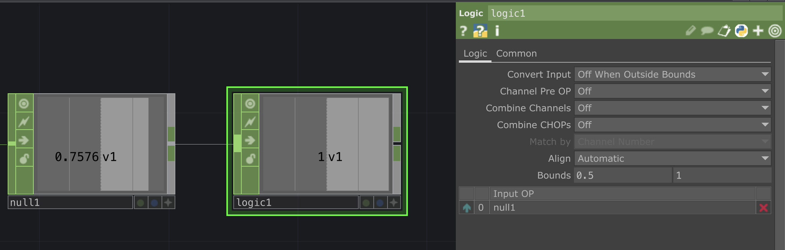
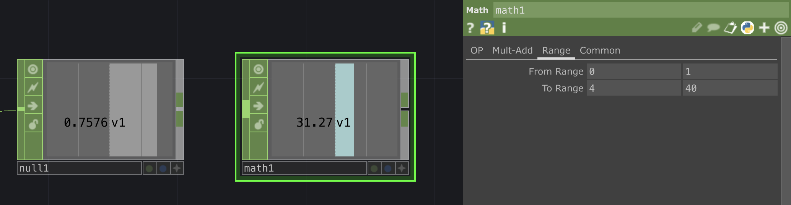

# TD_Arduino_FR

**Ou comment créer une communication Serial entre Touchdesigner et Arduino**

- Le tuto [introduction à Touchdesigner](https://github.com/LucieMrc/IntroTD_FR)

# Set-up

Avoir une arduino branchée à l'ordinateur qui envoit des informations au moniteur série :

```
void setup() {
  Serial.begin(9600);
}

void loop() {
  Serial.write("1");
  delay(1000);
  Serial.write("0");
  delay(1000);
}
```
Ici mon code envoie alternativement 0 et 1 toutes les secondes. J'utilise `Serial.write()` au lieu de `Serial.println()` afin d'envoyer mes valeurs sous forme de bytes.


Je reçois bien mes valeurs dans le Serial Monitor de l'IDE Arduino.

Il faut ABSOLUMENT fermer le Serial Monitor pour que les messages Serial arrivent dans TouchDesigner : l'arduino ne communique qu'avec un à la fois.
De la même façon, il faut désactiver la réception série dans Touchdesigner pour pouvoir upload du code sur l'arduino, sinon le port sera occupé et le téléversement sera impossible.

Dans TouchDesigner, on crée un `Serial` DAT qui va recevoir et stocker les données dans un tableau.


Afin de recevoir les données, il faut d'abord sélectionner le port dans les paramètres du Serial DAT. À droite du paramètre "Port", on clique sur la flèche ➡️ pour voir la liste des ports disponibles.


Comme on envoie des données en binaires, il faut sélectionner "One Per Byte" dans le paramètres "Row/Callback Format" (au lieu de "One Per Line" qui est par défaut).


Si tout est bon, on reçoit les données dans le node Serial DAT toutes les secondes.

# Récupérer les données


On crée un `DAT To` CHOP, afin de récupérer la dernière donnée reçue et la "transformer" en valeur utilisable dans TouchDesigner. Il faut faire glisser le `Serial` DAT sur le `DAT To` CHOP afin que le CHOP "regarde" le DAT.


Pour regarder uniquement la dernière ligne (= la dernière donnée reçue), dans le paramètre "Select Rows" on choisit "By Index", puis on prend l'index de la dernière ligne en tant que "Start Row Index" et "End Row Index".

Par défaut, il y a 10 lignes dans le Serial DAT, donc je mets 1O pour les deux indexs de rang.

On peux sélectionner toutes les colonnes vu qu'il n'y a qu'une seule colonne, mais il faut préciser que la donnée de la ligne est la valeur et non le nom de la valeur.


Dans le paramètre "First Column is", on sélectionne "Values" (au lieu de "Names" par défaut). On a donc une valeur qui a un pour nom "chan1" (le nom par défaut des valeurs dans TouchDesigner) et qui alterne entre 0 et 1.

# Utiliser les données

<details>
 <summary> Vérifier qu'on est dans une plage de donnée </summary>

 On crée un `Logic` CHOP, on coche "Off when outside bounds", et on choisit les Bounds.



Le logic est à 1 si on est entre les bornes et à 0 si on n'y est pas.
On peux choisit une valeur précise en mettant la même chose pour les deux bornes

</details>

 <details>
 <summary> Changer la plage de données </summary>

On crée un `Math` CHOP, on va dans l'onglet "Range" des paramètres, on met le minimum et maximum de la plage de données actuelle dans le paramètre "From Range" et le minimum et maximum de la plage de données souhaitées dans le paramètre "To Range".



La valeur est recalculée de manière proportionnelle.

</details>


<details>
 <summary> Interpoler les valeurs </summary>

On crée un `Filter` CHOP, on choisit la durée du filtre dans le paramètre "Filter Width".


La courbe est adoucie.


</details>

# Envoyer des données

Avoir une arduino branchée à l'ordinateur qui reçoit des informations :

```
int incomingByte = 0;

void setup() {
  Serial.begin(9600);
}

void loop() {
  if (Serial.available() > 0) {
    incomingByte = Serial.read(); // on stock ce que les messages reçus en série dans la variable incomingByte

    Serial.println(incomingByte); // on print le message reçu
  }
}
```

On garde le moniteur série fermé dans l'IDE Arduino pour que le port soit libre pour communiquer avec Touchdesigner.


Dans Touchdesigner, on crée un `Serial` DAT, et comme pour la réception de donnée on choisit le port à laquelle est connectée l'Arduino.

Pour envoyer par exemple la valeur d'un slider, on crée un `Slider` COMP connecté à un `Null` CHOP.


Ensuite on crée un `CHOP Execute` DAT, qui va servir à exécuter un script en fonction du comportement d'un CHOP.

Le CHOP Execute contient plusieurs fonctions :
- `offToOn` : s'exécute quand la valeur du CHOP passe de 0 à 1
- `whileOn` : s'exécute quand la valeur du CHOP est 1
- `onToOff` : s'exécute quand la valeur du CHOP passe de 1 à 0
- `whileOff` : s'exécute quand la valeur du CHOP est 0
- `valueChange` : s'exécute quand la valeur du CHOP change

Les arguments des fonctions sont définis comme :
- channel - the Channel object which has changed
- sampleIndex - the index of the changed sample
- val - the numeric value of the changed sample
- prev - the previous sample value

On fait glisser le `null1` CHOP sur le CHOP Execute afin que ce soit celui là qui est "écouté" (son nom apparaît dans le paramètres "CHOPs").

On coche le paramètre "Value Change" afin que ce soit cette fonction qui s'exécute, car on veux envoyer la valeur du slider dès qu'elle change. 


En écrivant ``op('serial1').send(val,  terminator='\r\n')`` dans la fonction valueChange, on envoie ainsi la valeur du CHOP au DAT "serial1" qui communique avec l'arduino.

"terminator='\r\n'" sert à terminer le message pour séparer les messages entre eux.


# Aller + loin

# TD_Arduino_EN
